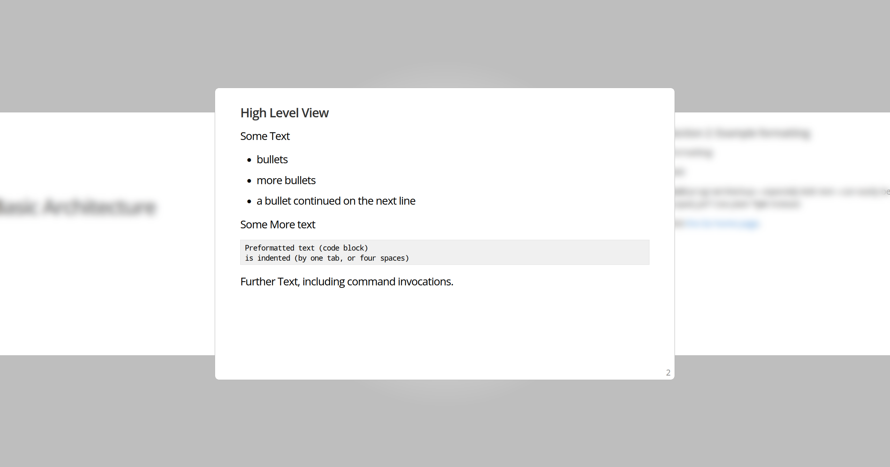

## About the repo

I blatantly took the static and template files from the "present" tool source code
(https://cs.opensource.google/go/x/tools/+/internal-branch.go1.20-vendor:cmd/present/)
and used my poor HTML and CSS knowledge to improve the default templates with something
that I find a bit less disruptive, and a bit neater.

## Using the repository

`git clone` the repository to your disk, then run `present -base <THIS_REPO_PATH>/present-assets`
in the directory with your `.slides` files.

## Installing present

To install present, run `go install golang.org/x/tools/cmd/present@latest`.

## Markdown docs

Find documentation on how to create presentations with the `present` tool at
https://pkg.go.dev/golang.org/x/tools/present.

## What it actually looks like

I made the current slide be visible, the others are blurred. Switching between
the slides is animated, and the glass effect has a little fade.

